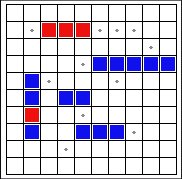
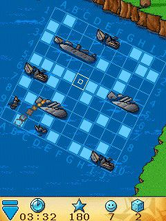

                                                              BATTLESHIP

This is the Battleship project General idea Battleship is usually a two-player game, where each player has a fleet of ships and an ocean where the ships are placed, 
but hidden from the other player, and both players compete to sink the other player's fleet first. 

Each ship of the Fleet might be of one of the following ship types, which differ with the number of vertically or horizontally adjacent Ocean cells in a line they occupy:

Carrier (5 cells); Battleship (4 cells); Cruiser (3 cells); Destroyer (2 cell).

How to win Each player has a battlefield represented by a 10x10 grid (default) on which he places 4 ships, hidden from his opponent. 
The goal of the game is to sink all the opposing ships! A ship is sunk when it is hit once for each space it occupies. 
In other words, a submarine, which occupies two spaces, is sunk after being hit twice. The 4 ships occupy 14 total spaces, so the first player to record 14 hits wins!

Place your ships To place a ship you need to enter a departure coordinate (A1-J10 for the default 10x10 board) and a direction (vertical or horizontal). 
For example: "A1" and 'H' or "B7" and 'V'. Shoot the enemy ships Once both players have configured their ships, the battle may have started!

Shoot the Enemy Ships: Shoot your opponent’s ships by matching the coordinates. You will be informed if you have hit or missed a ship.
A ship is sunk after being hit once for each space it occupies. Sink all 5 computer ships to win!

Contributing
If you have a suggestion that would make this better, please fork the repo and create a pull request. You can also simply open an issue with the tag "enhancement". Don't forget to give the project a star! Thanks again!

Fork the Project
Create your Feature Branch (git checkout -b feature/AmazingFeature)
Commit your Changes (git commit -m 'Add some AmazingFeature')
Push to the Branch (git push origin feature/AmazingFeature)
Open a Pull Request

Technologies:
Java
